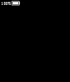

# battery-bar

Pebble library for easily adding a battery bar to your app.



## Usage

`pebble package install ...`

````c
// This is a simple example, demonstrating the basic usage.
#include "battery-bar/battery-bar.h"

static BatteryBarLayer *s_battery_layer;

static void window_load(Window *window) {
  Layer *window_layer = window_get_root_layer(window);

  s_battery_layer = battery_bar_layer_create();
  layer_add_child(window_layer, s_battery_layer);
}

static void window_unload(Window *window) {
  battery_bar_layer_destroy(s_battery_layer);
}

````

## Additional Settings

Position the battery bar on screen.

    void battery_bar_set_position(GPoint position);

Hide the percentage text (100%).

    void battery_bar_set_percent_hidden(bool hidden);

Hide the battery icon.

    void battery_bar_set_icon_hidden(bool hidden);

Override the color scheme for each state.

    void battery_bar_set_colors(GColor normal, GColor warning, GColor danger, GColor charging);
